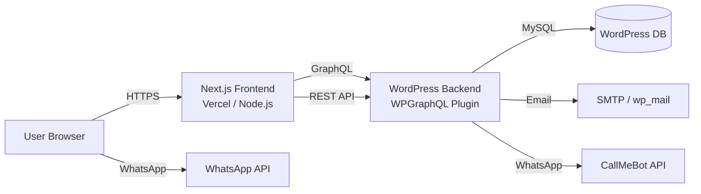
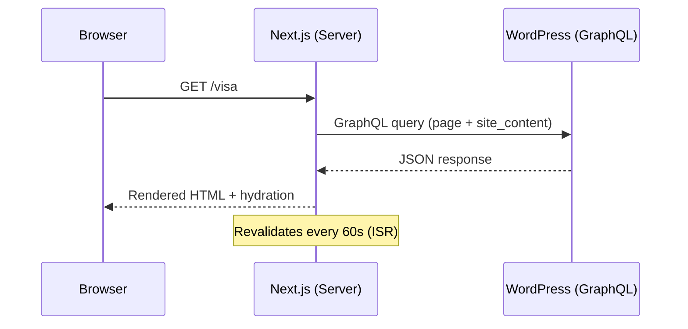
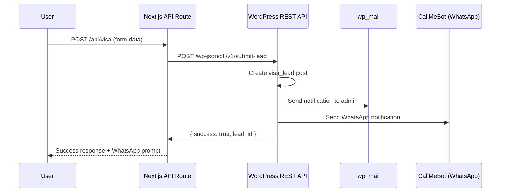
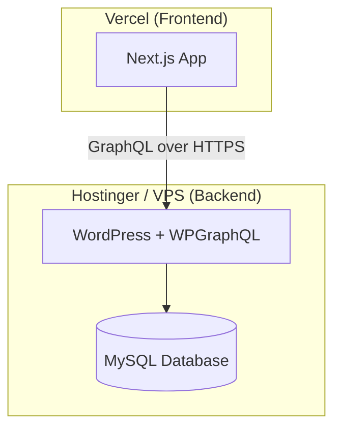

# Canton Fair India — Technical Architecture Document

> **Audience:** Developers, DevOps engineers  
> **Purpose:** Full technical overview of the platform's architecture, data flow, and deployment.

---

## 1. System Overview

Canton Fair India is a **headless CMS** platform built with:

- **Backend (CMS):** WordPress (Local WP / self-hosted)
- **Frontend:** Next.js 16 (React 19, App Router)
- **Data Layer:** WPGraphQL (GraphQL API)
- **Styling:** Tailwind CSS v4 + Typography plugin
- **Animations:** Framer Motion
- **Icons:** Lucide React



---

## 2. Directory Structure

```
cantonfairindiacom/
├── .gitignore
├── frontend/                  ← Next.js Application
│   ├── app/                   ← App Router (Pages & API Routes)
│   │   ├── page.js            ← Home page
│   │   ├── layout.js          ← Root layout (global header/footer)
│   │   ├── globals.css        ← Tailwind config + custom theme
│   │   ├── [slug]/page.js     ← Dynamic catch-all page (WP pages)
│   │   ├── visa/page.js       ← Visa assistance page
│   │   ├── canton-fair/page.js← Canton Fair guide page
│   │   ├── trips/page.js      ← Sourcing trips overview
│   │   ├── trips/[slug]/      ← Individual trip detail
│   │   ├── blog/page.js       ← Blog listing
│   │   ├── blog/[slug]/       ← Individual blog post
│   │   ├── faq/page.js        ← FAQ page
│   │   ├── guidance/page.js   ← Guidance hub
│   │   ├── guidance/[slug]/   ← Individual guide
│   │   ├── login/page.js      ← Client portal (placeholder)
│   │   └── api/visa/route.js  ← API route (proxies form to WP)
│   ├── components/            ← Reusable React Components
│   │   ├── Header.jsx         ← Client-side nav with scroll effect
│   │   ├── DynamicHeader.jsx  ← Server component wrapper (fetches menu)
│   │   ├── Footer.jsx         ← Footer with dynamic content
│   │   ├── DynamicFooter.jsx  ← Server component wrapper (fetches content)
│   │   ├── Hero.jsx           ← Animated hero section
│   │   ├── SourcingGrid.jsx   ← Trip cards grid
│   │   ├── VisaForm.jsx       ← Multi-step visa form
│   │   ├── FAQ.jsx            ← Accordion FAQ component
│   │   ├── ChinaMarketTable.jsx ← Wholesale market reference table
│   │   └── WhatsAppButton.jsx ← Floating WhatsApp CTA
│   ├── lib/
│   │   └── wordpress.js       ← GraphQL client + all query functions
│   ├── public/images/         ← Static images
│   ├── scripts/               ← Content seeding/migration scripts
│   ├── .env.local             ← WORDPRESS_API_URL
│   └── package.json
│
├── app/public/wp-content/
│   └── mu-plugins/
│       └── cantonfairindia-leads.php  ← Custom WordPress plugin
│
├── post_cities.json           ← Blog post data (seeding)
├── post_india_trade.json      ← Blog post data (seeding)
└── publish_post.py            ← Blog publishing script
```

---

## 3. WordPress Custom Post Types

The mu-plugin (`cantonfairindia-leads.php`) registers **5 Custom Post Types**:

| Post Type       | GraphQL Name   | Purpose                              | Supports           |
|-----------------|----------------|---------------------------------------|---------------------|
| `visa_lead`     | *(not exposed)* | Stores form submissions              | title, custom-fields|
| `itinerary_day` | `itineraryDay` | Day-by-day trip itineraries           | title, editor, thumbnail, custom-fields |
| `trip`          | `trip`         | Sourcing trip packages                | title, editor, thumbnail, custom-fields |
| `faq`           | `faq`          | FAQ entries (Q&A)                     | title, editor       |
| `site_content`  | `siteContent`  | Dynamic content blocks (hero, footer) | title, editor, custom-fields |

### Custom Meta Fields

**Trip:**
| Meta Key         | Type   | Description                  |
|------------------|--------|------------------------------|
| `trip_price`     | String | Display price                |
| `trip_city`      | String | City label                   |
| `trip_features`  | String | Comma-separated features     |
| `trip_image_url` | String | Cover image URL              |

**Itinerary Day:**
| Meta Key                | Type   | Description              |
|-------------------------|--------|--------------------------|
| `itinerary_day`         | Int    | Day number               |
| `itinerary_location`    | String | Location name            |
| `itinerary_highlights`  | String | Day highlights           |

**Site Content:**
| Meta Key       | Type   | Description               |
|----------------|--------|---------------------------|
| `hero_heading` | String | Hero section heading      |
| `content_json` | String | JSON blob for dynamic data|

---

## 4. API Endpoints

### GraphQL (via WPGraphQL plugin)
- **URL:** `{WORDPRESS_URL}/graphql`
- Used for: All read operations (trips, posts, FAQs, pages, menus, site content)

### REST API (Custom)
| Endpoint                      | Method | Purpose                    | Auth              |
|-------------------------------|--------|----------------------------|--------------------|
| `/wp-json/cfi/v1/submit-lead` | POST   | Submit visa lead           | Secret key in body |
| `/wp-json/cfi/v1/seed-content`| POST   | Seed default site content  | Open (one-time use)|

---

## 5. Data Flow

### Page Rendering (Server-Side)


### Form Submission


---

## 6. GraphQL Query Functions

All queries are centralized in `frontend/lib/wordpress.js`:

| Function            | GraphQL Query         | Returns                                   |
|---------------------|-----------------------|-------------------------------------------|
| `getTrips()`        | `trips { nodes }`     | All trips with tripFields                 |
| `getTripBySlug()`   | `trip(id, SLUG)`      | Single trip with content + fields          |
| `getPosts()`        | `posts(first: 20)`    | Blog posts with excerpt + featured image   |
| `getPostBySlug()`   | `post(id, SLUG)`      | Single post with full content              |
| `getFAQs()`         | `faqs(first: 20)`     | All FAQs (title + content)                |
| `getPageBySlug()`   | `page(id, URI)`       | Any WordPress page by slug                 |
| `getGuidancePages()`| `pages(parent: guidance)` | Child pages of "Guidance"              |
| `getMenu(slug)`     | `menu(id, SLUG)`      | Menu items (header or footer)              |
| `getHeroContent()`  | `siteContents(hero-section)` | Hero heading + tagline             |
| `getSiteContent()`  | `siteContents(name)`  | Any site_content item with parsed JSON     |

**Caching:** All queries use `next: { revalidate: 60 }` (ISR — Incremental Static Regeneration, 60-second cache).

---

## 7. Component Architecture

### Server Components (Data Fetching)
- `DynamicHeader.jsx` → fetches menu → renders `Header.jsx`
- `DynamicFooter.jsx` → fetches menu + footer content → renders `Footer.jsx`
- All `page.js` files → fetch data from GraphQL

### Client Components (`"use client"`)
- `Header.jsx` → scroll detection, navigation state
- `Hero.jsx` → Framer Motion animations
- `SourcingGrid.jsx` → scroll-triggered animations
- `FAQ.jsx` → accordion toggle state
- `VisaForm.jsx` → form state, fetch submission, WhatsApp integration
- `WhatsAppButton.jsx` → floating CTA

### Design System (Tailwind v4)
```css
--color-dragon-red:   #DE2910    /* Primary CTA, accents */
--color-dragon-blue:  #1e293b    /* Text, backgrounds */
--color-dragon-white: #ffffff    /* Clean backgrounds */
--font-sans:          Outfit, Inter  /* Headings, body */
```

---

## 8. Notification System

### Email Notifications
- Triggered on visa lead submission via `wp_mail()`
- Sends to `admin_email` (WordPress settings)
- HTML formatted with lead details

### WhatsApp Notifications
- Uses CallMeBot API
- Requires API key configuration in mu-plugin
- Sends lead name, phone, and occupation
- Also: client-side WhatsApp confirmation link after form success

---

## 9. WordPress Plugin Dependencies

| Plugin         | Purpose                                      |
|----------------|----------------------------------------------|
| **WPGraphQL**  | Exposes WordPress data via GraphQL endpoint   |
| **mu-plugin**  | Custom post types, REST API, GraphQL fields   |

> The mu-plugin auto-activates (no manual activation needed) because it's in the `mu-plugins` directory.

---

## 10. Environment Configuration

### Frontend (`frontend/.env.local`)
```
WORDPRESS_API_URL=http://cantonfairindiacom.local/graphql
```

### Production Deployment
```
WORDPRESS_API_URL=https://yourdomain.com/graphql
```

---

## 11. Deployment Architecture

### Recommended Setup


| Layer     | Platform          | Notes                                    |
|-----------|-------------------|------------------------------------------|
| Frontend  | Vercel            | Auto-deploy from GitHub, edge functions   |
| Backend   | Hostinger / VPS   | WordPress with WPGraphQL, HTTPS required  |
| Domain    | Hostinger DNS     | A record → Vercel, subdomain for WP admin |

### Build & Deploy Commands
```bash
# Development
cd frontend && npm run dev

# Production build
cd frontend && npm run build && npm start

# Vercel (auto)
# Connect GitHub repo → Vercel detects Next.js → auto-deploy
```

---

## 12. Security Considerations

| Area                  | Implementation                              |
|-----------------------|---------------------------------------------|
| Lead Submission       | Secret key validation (`cfi_secure_submission_2026`) |
| Input Sanitization    | WordPress `sanitize_text_field()`, `sanitize_email()` |
| GraphQL               | Read-only queries (no mutations exposed)    |
| CORS                  | Managed by WordPress / WPGraphQL settings   |
| API Proxy             | Form data proxied through Next.js API route |
| Sensitive Data        | `.env.local` excluded from git              |

> ⚠️ **Note:** The submission secret is hardcoded. For production, consider using environment variables.
